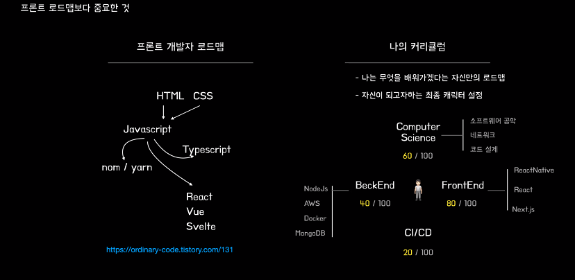
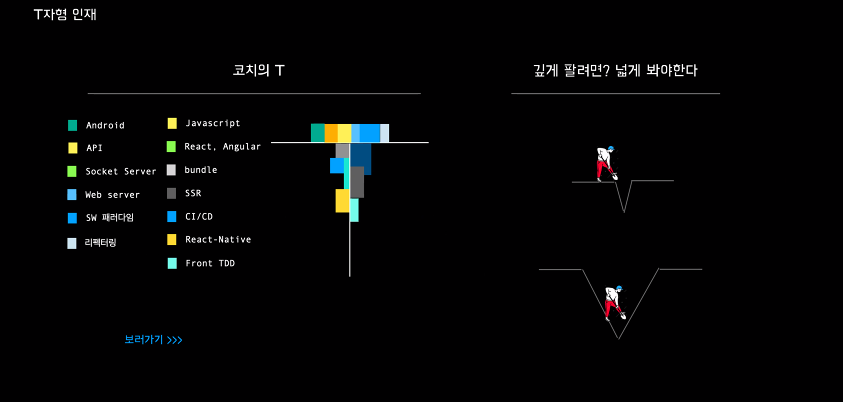

# 자바스크립트 학습
자바스크립트를 학습합니다. 자바스크립트의 기본적인 문법부터 사용법, 적절한 활용 방법을 학습합니다.   

또한, 좋은 가독성과 효율적으로 재사용할 수 있는 코드를 지향하기 때문에 이를 적극적으로 학습하려고 노력합니다.   

자바스크립트 뿐만 아니라 React JS, Node JS, TypeScript, Next JS를 학습합니다. 실제 개발 환경에서 자주 사용하는 기술을 학습하며 더욱 효율적으로 개발할 수 있는 능력을 쌓기 위해 노력합니다.   

<br/>

## 학습

|타이틀|폴더로 이동|
|---|:---:|
|**자바스크립트에 대해**|[이동](https://github.com/Hschan2/LearnJavascript/tree/main/About_Javascript)|
|**타입스크립트에 대해**|[이동](https://github.com/Hschan2/LearnJavascript/tree/main/TypeScript)|
|**바닐라 자바스크립트에 대해**|[이동](https://github.com/Hschan2/LearnJavascript/tree/main/VanillaJS)|
|**React JS에 대해**|[이동](https://github.com/Hschan2/LearnJavascript/tree/main/React)|
|**Next JS에 대해**|[이동](https://github.com/Hschan2/LearnJavascript/tree/main/react-nextjs)|
|**노마드코더의 Next JS**|[이동](https://github.com/Hschan2/LearnJavascript/tree/main/nomadcoders-nextjs)|
|**Graph QL에 대해**|[이동](https://github.com/Hschan2/LearnJavascript/tree/main/graphql)|
|**새로운 React 기능**|[이동](https://github.com/Hschan2/LearnJavascript/tree/main/new-react-function)|
|**Nest JS API 프레임워크에 대해**|[이동](https://github.com/Hschan2/LearnJavascript/tree/main/nest-api)|
|**NoSQL에 대해**|[이동](https://github.com/Hschan2/LearnJavascript/tree/main/NoSQL)|

<br/>

## 프로젝트
|타이틀|폴더로 이동|
|---|:---:|
|**깃허브 클론 페이지**|[이동](https://github.com/Hschan2/LearnJavascript/tree/main/WooA_GitPage)|
|**문자를 목소리로**|[이동](https://github.com/Hschan2/LearnJavascript/tree/main/TextToVoices)|
|**반응형 CSS**|[이동](https://github.com/Hschan2/LearnJavascript/tree/main/Responsive_CSS_Unit)|
|**드래그 앤 드롭 API**|[이동](https://github.com/Hschan2/LearnJavascript/tree/main/DragAndDropAPI_JS)|
|**파이어베이스 채팅 서비스**|[이동](https://github.com/Hschan2/LearnJavascript/tree/main/Firebase-Chat)|
|**프론트엔드 개발 페이지**|[이동](https://github.com/Hschan2/LearnJavascript/tree/main/FrontEnd_Web/First)|
|**React JS 프로젝트**|[이동](https://github.com/Hschan2/LearnJavascript/tree/main/React_Projects)|
|**스타벅스 클론 페이지**|[이동](https://github.com/Hschan2/LearnJavascript/tree/main/moonbucksMenu)|


# 웹 프론트엔드 학습 로드맵
## 평생 학습하며 성장하기 위한 가장 중요한 것을 찾자

### 소프트웨어 장인이 되겠다는 마음가짐?
```
소프트웨어 장인정신은 스스로가 선택한 직업에 책임감을 가지고, 지속적으로 새로운 도구와 기술을 익히며 발전하겠다는 마음가짐이다. 소프트웨어 장인정신은 책임감, 프로페셔널리즘, 실용주의, 소프트웨어 개발자로서의 자부심을 의미한다. - 소프트웨어 장인 책 중 -
```

### 소프트웨어 장인
- 개발자로서 어떤 마음가짐으로 살아갈 것인지에 대한
가이드를 제시하는 책
- 프로그래머라는 우리 업에 대한 자부심을 느끼고,
전문가로서의 책임과 역할에 대해 자세하게 기록   

### 소프트웨어 장인정신 매니페스토
- 동작하는 소프트웨어 뿐만 아니라, <b>정교하고 솜씨 있게 만들어진 작품</b>
- 변화에 대응하는 것뿐만 아니라, <b>계속해서 가치를 더하는 것</b>
- 개별적으로 협력하는 것뿐만 아니라, <b>프로페셔널 커뮤니티를 조성하는 것</b>
- 고객과 협업하는 것뿐만 아니라, <b>생산적인 동반자 관계들</b>   

이는 왼쪽의 항목들을 추구하는 과정에서 오른쪽 항목들이 꼭 필요하다는 것을 의미한다.   

### 의식적인 연습
- 의식적인 연습을 통해 효과적으로 학습하는 방식으로 설계해 진행해야 한다.
- 무조건 연습을 많이 한다고 실력이 향상되지 않는다.
- 점진적으로 난이도를 높여 가고, 피드백으로 받으면서 의식적으로 연습할 때 빠르게 성장할 수 있다.   

### 1만 시간의 재발견
의식적인 연습이 무엇이며, 의식적인 연습이 가능하도록 설계하는 방법에 대해 다루는 책이다.

#### 의식적인 연습의 7가지 원칙
- 첫째, 효과적인 훈련 기법이 수립되어 있는 기술 연마
- 둘째, 개인의 컴포트 존을 벗어난 지점에서 진행하고 자신의 현재 능력을 살짝 넘어가는 작업을 지속적으로 시도
- 셋째, 명확하고 구체적인 목표를 가지고 진행
- 넷째, 신중하고 계획적. 즉, 개인이 온전히 집중하고 '의식적'으로 행동할 것을 요구
- 다섯째, 피드백과 피드백에 따른 행동 변경을 수반
- 여섯째, 효과적인 심적 표상을 만들어내는 한편으로 심적 표상에 의존
- 일곱째, 기존에 습득한 기술의 특정 부분을 집중적으로 개선함으로써 발전시키고, 수정하는 과정을 수반   

#### 의식적인 연습을 위한 도전거리 찾기
- 클린코드 책에서 제시하는 원칙 지키기
    - 함수는 한 가지를 해야 하고 한 가지를 잘 해야 하고 그 한 가지 만을 해야 한다.
    - 중첩 구조가 생길만큼 함수가 커져서는 안된다. 그러므로 함수에서 들여쓰기 수준은 1단이나 2단을 넘어서면 안 된다.
- <b>초보자일 때 가능하면 정성적인 원칙보다 정량적인 원칙으로 연습한다.</b>   

### 함께 자라기
내가 성장하는 방법, 우리가 함께 성장하는 방법, 매일매일 성장하는 방법에 대해 다루고 있는 책이다. 나와 팀이 같이 성장하는 방법을 알고 싶다면 반드시 읽어볼 것을 추천한다.   

## 클린 코드
현장에서는 읽기 좋은 코드, 유지 보수하기 좋은 코드를 구현하는 역량이 중요하다. 클린 코드를 구현하는 연습은 개발자로 살아가는 평생 해야 한다. 클린 코드를 구현하는 좋은 연습은 단위 테스트를 기반으로 지속적인 리팩터링을 통해 향상할 수 있다.   

### 좋은 코드, 나쁜 코드
나쁜 코드에 대해 이유를 설명하고, 좋은 코드로 바꿔가는 과정을 볼 수 있는 책이다. 다양하고 구체적인 코드 예시를 통해 이론으로 배운 코드 작성 방법을 실제로 어떻게 적용하는지 알 수 있다. 책을 읽으며 좋은 코드에 대한 본인의 기준을 세우고, 기존에 작성한 코드에 적용하면서 학습하는 것을 추천한다.   

### Clean Code 클린 코드
클린 코드를 구현하기 위한 다양한 규칙들을 설명하는 책이다. 책 예제 코드가 자바 기반으로 구현되어 있으며, 다양한 예제를 통해 설명하고 있다. 클린 코드에 관심이 있는 개발자라면 반드시 읽어야 할 책이다.   

### 테스트 주도 개발 시작하기
이 책은<b>TDD(Test-Driven Development)</b>는 테스트부터 시작한다. 구현을 먼저 하고 나중에 테스트하는 것이 아니라 먼저 테스트를 하고 그다음에 구현한다. 구현 코드가 없는데 어떻게 테스트할 수 있을까? 여기서 테스트를 먼저 한다는 것은 기능이 올바르게 동작하는지 검증하는 테스트 코드를 작성한다는 것을 의미한다. 기능을 검증하는 테스트 코드를 먼저 작성하고 테스트를 통과시키기 위해 개발을 진행한다.   

### 테스트 주도 개발
TDD의 구체적 사례와 패턴을 제시하고 있다. TDD를 제대로 연습하고 경험하고 싶다면 반드시 읽고 실습해 봐야 할 책이다.   

### 리팩터링 2판
리팩터링 개념, 리팩터링이 필요한 이유와 다양한 리팩터링 카탈로그를 제공하는 책이다. 책의 카탈로그가 나오기 전까지가 핵심적인 내용이다. 카탈로그는 필요한 시점에 참고하는 용도로 사용한다.   

## 객체지향 설계
현재 대부분의 언어가 객체지향 패러다임을 기반으로 하고 있다. 따라서 객체지향 연습은 필수이다.   

### 객체지향의 사실과 오해
<b>객체지향</b>이란 무엇인가라는 원론적 면에서도 다소 위험한 질문에 답하기 위해 쓰인 책이다. 안타깝게도 많은 사람들이 객체지향의 본질을 오해하고 있다. 가장 널리 퍼져있는 오해는 클래스가 객체지향 프로그래밍의 중심이라는 것이다. 객체지향으로 향하는 첫걸음은 클래스가 아니라 객체를 바라보는 것에서부터 시작한다.   

## 자바스크립트
오해하기 쉬운 자바스크립트 개념들을 확실하게 알아두는 것은 의식적으로 해야하는
연습이다. 처음 접한 당시에는 이해하기 어려우나, 꾸준히 학습해 나가는 과정에서 되돌아본다면 더 명확하게 이해할 수 있는 개념들이 있다.   

### 코어 자바스크립트
ES2015+부터 학습하는 시대에 이전 스펙의 필요성을 느끼기 어려울 수 있다. 하지만 이전 스펙의 핵심 개념들은 여전히 유효하며 이를 무시할 수 없다. 이 책에서는 ```JavaScript의 핵심 개념들 중 현시대에도 유효한 것들 위주로 적절하게 간추려져 있다.``` 또한, 원리와 이해를 목적으로 두고 있어 JavaScript 언어론 기반 지식을 쌓는데 매우 유용하다.   

### 자바스크립트는 왜 그 모양일까?
저자 더글라스 크락포드는 JSON의 창시자이자 JavaScript 전문가로 생태계에 큰 영향을 준 구루 개발자로 과거 출판된 저서 ```더글라스 크락포드의 자바스크립트 핵심 가이드```에서는 JavaScript의 좋은 점과 아쉬운 점을 다루며 효율적인 코드를 작성하는 방법에 대해 기술했으며 얇은 책임에도 불구하고 심도 깊은 내용으로 큰 인기를 끌었다. 그리고 10년 만에 출판된 자바스크립트는 왜 그 모양일까? 는 그동안 JavaScript가 어떻게 변화해왔는지를 가감 없이 드러내며 동작 방식과 변천사를 살펴본다. 어렵고 유용하지만 흥미로운 구어체가 가득해 재미있게 읽을 수 있는 색다른 매력을 지닌 책이다.   

### 프레임워크 없는 프론트엔드 개발
“프레임워크 없는 운동”이란 커뮤니티가 무엇인지 모른다면 한 번쯤 읽어보는 것을 권장한다. 수많은 프레임워크가 등장하며 무엇을 공부해야 할지 무엇을 사용해야 하는지 수 많은 자바스크립트 피로 현상이 점점 커지게 되었는데 프레임워크가 없이도
가능하다는 다양한 시각과 구현 방법들을 체험해볼 수 있는 매력이 있다.   

### 타입스크립트 프로그래밍
타입스크립트는 이제 더 이상 선택이 아닌 필수가 되어가고 있다. 그래서 그런지 요즘 ```이펙티브 타입스크립트```를 읽는 것이 너무나 당연해지고 있는데 입문자에게는 그보다 더 훌륭한 선택지가 될 수 있다. 예제부터 상세한 설명까지 공식 문서에 버금가는 수준이다.   

# 정리
웹 프론트엔드 학습 로드맵이 책을 기준으로 정리가 되어 있다. 여기서 나온 책들을 무조건 읽어보라는 것은 아니다. 다만, 책이 나타내는 주제들을 확실하게 알아두는 것이 중요하다.   

1. 소프트웨어에 대해   
2. 구체적인 생각과 의식들 갖기   
3. 클린 코드   
4. 테스트 주도 개발   
5. 객체지향   
6. 자바스크립트   
7. 도구 사용없는 프론트엔드 개발   
8. 타입스크립트   

위의 나열된 주제들을 이해하고 학습 과정을 거치는 것에 대해 생각하자.   

# 개발자 준비하기
## 개발자 역할
- 기술적인 분야
    - Coding
    - App/Web 이슈 대응
    - 서버 구축/운영
    - 품질 관리
    - 개발 프로세스 확립
- 커뮤니케이션 분야
    - 타부서와의 협업
    - 기술 검토
    - 기술적 조언
    - 기술 문서 관리   

## 포트폴리오와 개발자의 가장 강력한 취업 무기
- 포트폴리오: 겉에만 핥아본 경험보다 더욱 깊은 시도와 실패를 겪은 서비스를 경험하기
    - 소켓 통신을 통한 실시간 그룹 알림 및 채팅 서비스
    - TCP 서버 구현/Web 서버 구축(Nginx)
    - Redis 인메모리 DB 선정(+ MySql)
- 가시적인 성과와 난이도 있는 개발
    - 트렌디한 기술 경험
    - 난이도 있는 기술 이해와 직접 구현 경험
    - 직접 만든 서비스 런칭 및 운영과 서비스 발전 경험
    - 기술 블로그
    - 오픈소스 기여 활동   

## 구직자가 우위에 서는 면접
- 임팩트가 없다면 최대한 가지고 있는 모든 내용을 전달할 것
- 지원서 구성 갖추기
    - 한 눈에 보이는 이력서
    - 포트폴리오 정리 문서
    - 자기소개서 한 장 분량
    - 임원면접용 PT
- 임원면접을 중요시 하는 것
    - 사전조사
        - 뉴스 기사 최대한 많이 찾아보기
        - CEO 인터뷰 내용 찾아보기
        - 투자 및 성과지표 찾아보기
    - 2 ~ 3장 분량의 자기소개 PT
        - 나의 기술적 장점과 방향성
        - 회사의 방향성과 다루는 기술   

## 기업이 신입 개발자에 바라는 점
- 성장가능성
    - 개발 기초 지식
    - 기술적인 경험과 성장가능성
    - 대화를 진행하는 태도
    - 업무와 협업에 대한 태도
- 보여줄 수 있는 모든 것에 대해 "총공세"
    - 포트폴리오 공들이기
        - 이력서 용도별 분리
        - 포트폴리오 상세 기술
    - 학습한 내용 기록
        - Github 관리
        - 기술 블로그 관리
    - 면접 준비
        - 임원면접 PT 준비
        - 질문에 답변하지 못한 내용들 학습
        - 실시간 코딩 대비   

## 프론트엔드 개발자가 되려면
- 형식적인 프론트엔드 개발자 로드맵보다 나의 커리큘럼 로드맵 만들기


<br/>

- 신입 시기(1년차)
    - 넓고 얕게 자신의 방향 탐색하기
    - 전체 시스템을 이해하고 해결능력 갖추기
    - 컴퓨터 공학의 기반을 강화하는 방향 잡기
- 중니어 시기(5 ~ 6년차)
    - 특정 영역을 강화하기
    - SW 품질과 리팩토링에 대한 능력 강화하기
    - 기술적 이해도를 깊게 파기
        - 크로스 플랫폼/프론트
        - 아키텍처/패러다임(객체, 함수)
        - 디자인 패턴
        - 리팩토링
        - 테스트 코드
    - 사용하는 기술 관련 깊게 파기   



<br/>

- 라이브러리: React JS, Vue, Angular, Next JS, Remix
    - 코드 구조/설계 구조화에 대한 고민하기
    - 클린코드/리팩토링에 대한 고민하기
    - 역할 세분화/비교 후 선택하기
- 크로스 플랫폼: React Native, Flutter
    - 다양한 플랫폼에 대한 이해하기
    - 네이티브 대비 생산성 극대화하기
- 고성능/Web3: WA, Rust
    - 고성능에 대한 수요 증가로 필요성 발견하기
    - 새로운 개발 환경에 대해 주시하기   

### 프론트엔드 개발자
- 프론트엔드 언어 숙련도 높이기
    - JavaScript
    - Rust
    - Kotlin
    - Java
    - Swift
- 클라이언트 서버 CI/CD
    - 서버 구축/운영
    - SSR 구축
        - 파이어베이스
        - AWS Amplify
        - Next JS
        - GraphQL
- 브라우저 환경과 모바일 환경 대응하기
- 모바일 프레임워크 숙련도 높이기
    - ASO(앱 스토어 최적화)
    - IOS(Swift)
    - React Native
    - Flutter
    - Android Studio
- 코드 설계/코드 리팩토링/패턴 적용하기
    - 컴포넌트 설계
    - 클린코드
    - 클린 아키텍처   

## 실전에서 마주하게 될 고민
- 일정 산정: 일정을 산정하는 대표, 기획자, 팀장, 담당자마다 다른 일정 산정 문제에 대해 어떻게 효율적인 방법을 제시할 것인가?   


